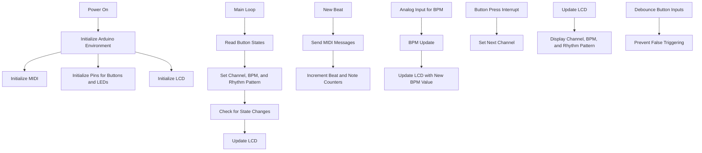

# Arduino MIDI Drum Sequencer

A versatile and customizable MIDI drum sequencer for Arduino, designed to control drum machines, virtual instruments, or hardware synths via MIDI.

## Table of Contents

- [Introduction](#introduction)
- [Features](#features)
- [Overview](#overview)
- [Prerequisites](#prerequisites)
- [Hardware Setup](#hardware-setup)
- [Usage](#usage)
- [License](#license)

## Introduction

This project aims to provide a simple and customizable MIDI drum sequencer using an Arduino board. It is designed to work with drum machines, virtual instruments, or hardware synths, providing an easy and intuitive way to create rhythm patterns and sequences.

## Features

- Tempo control with customizable BPM
- Channel switching for different drum instruments
- Support for various MIDI note values
- Intuitive user interface with buttons and an LCD screen

## Overview

The Arduino-based MIDI drum sequencer sends MIDI messages to a host PC running a digital audio workstation (DAW) such as Waveform Free. The sequencer uses an I2C liquid crystal display (LCD) and buttons for control. The LiquidCrystal_I2C and MIDI libraries are included, and an LCD object is created with address 0x27 and 16 columns and 2 rows. Drum instruments and their corresponding MIDI notes are defined using constants and arrays, while rhythm patterns for the sequencer are defined using multi-dimensional arrays.

### Libraries and Initialization

- The LiquidCrystal_I2C and MIDI libraries are included.
- An LCD object is created with address 0x27 and 16 columns and 2 rows.
- MIDI_CREATE_DEFAULT_INSTANCE() creates a default instance of the MIDI class.

### Drum Instruments and Rhythm Patterns

- Drum instruments and their corresponding MIDI notes are defined using constants and arrays.
- Rhythm patterns for the sequencer are defined using multi-dimensional arrays.

### Variables and Functions

- Variables related to beats, notes, channels, buttons, and LEDs are defined.
- The setup() function initializes the Arduino environment, including MIDI, pins for buttons and LEDs, https://www.arduino.cc/en/software).
and the LCD.
- The loop() https://github.com/FortySevenEffects/arduino_midi_library) and function https://github.com/johnrickman/LiquidCrystal_I2C) using the
https://github.com
https://www.arduino.cc/en/software).
is the main loop of the program. It reads the current state of the buttons and sets the channel, BPM, and rhythm pattern accordingly. It then checks if the state has changed and updates the LCD.
- The beat() function is called every time a new beat occurs. It sends MIDI messages for all instruments in the current rhythm pattern, and increments the beat and note counters.
- The BPM_UPDATE() function reads the analog input from the potentiometer and maps the value to the BPM range. It also updates the LCD with the new BPM value.
- The ISR(PCINT2_vect) function is an interrupt service routine for the buttons. It handles button presses and sets the next channel to be used.
- The lcd_update() function updates the LCD with the current channel, BPM, and rhythm pattern information.
- The debounce() function is used to debounce button inputs, preventing false triggering due to mechanical noise.

## Button Handling with Interrupt Service Routine (ISR)

In the code, an Interrupt Service Routine (ISR) is used to handle button presses. The reason for using an ISR is to achieve a more responsive and efficient behavior when processing button inputs.

Here are some reasons why using an ISR can be advantageous in this context:

1. **Responsiveness**: ISRs allow the program to respond to button presses immediately, rather than waiting for the main loop to finish its current iteration. This can result in a more responsive user interface, as the program can react to button presses in real-time.

2. **Efficiency**: By using an ISR, the program does not have to continuously poll the button states in the main loop. Instead, it only responds when there is an actual button press event. This can save processing resources, as the microcontroller is not occupied with constant button polling.

3. **Minimize Latency**: In a time-sensitive application like a MIDI drum sequencer, minimizing latency is crucial for accurate and consistent performance. Using an ISR to handle button inputs can help minimize latency by quickly responding to button presses and updating the related variables.

### Debouncing Buttons

This code takes measures against button chattering (also known as debounce). The `debounce()` function is used to prevent false triggering of button presses due to mechanical noise or contact bouncing. When a button press is detected, the debounce function waits for a short period (in this case, 50 milliseconds) before reading the button state again. If the button state is still the same after the delay, the code considers it a valid button press. This helps filter out any false triggers caused by the mechanical noise or bouncing of the button contacts.

## Prerequisites

### Hardware

- Arduino board (e.g., Uno, Mega, etc.)
- MIDI interface (e.g., MIDI shield, breakout board, or DIY circuit)
- Push buttons, LEDs, and resistors for the user interface
- 16x2 LCD screen with I2C interface

### Software

- Arduino IDE
- MIDI library for Arduino
- LiquidCrystal_I2C library
- Digital Audio Workstation (DAW) with MIDI support, such as Waveform Free

## Hardware Setup

Follow these steps to connect the hardware components:

1. Connect the MIDI interface to your Arduino board as per the manufacturer's instructions or the MIDI library documentation.
2. Wire the push buttons, LEDs, and resistors to the appropriate digital pins on the Arduino board.
3. Connect the 16x2 LCD screen to the I2C interface on the Arduino board.
4. Refer to the code for specific pin assignments and adjust as needed.

## Usage

After setting up the hardware and uploading the code, follow these steps to use the drum sequencer:

1. Power on the Arduino board and connect it to your MIDI device or DAW via the MIDI interface.
2. Use the buttons to create and modify rhythm patterns, select drum instruments, and adjust the tempo.
3. Refer to the LCD screen for real-time feedback on your settings and sequences.

## License

This project is licensed under the MIT License. See the LICENSE file for details.
